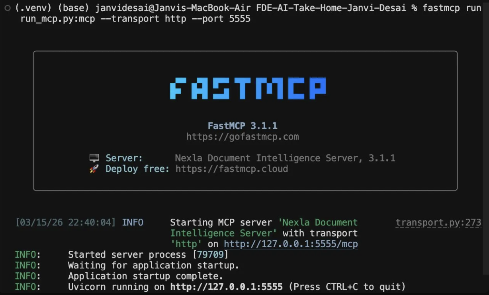
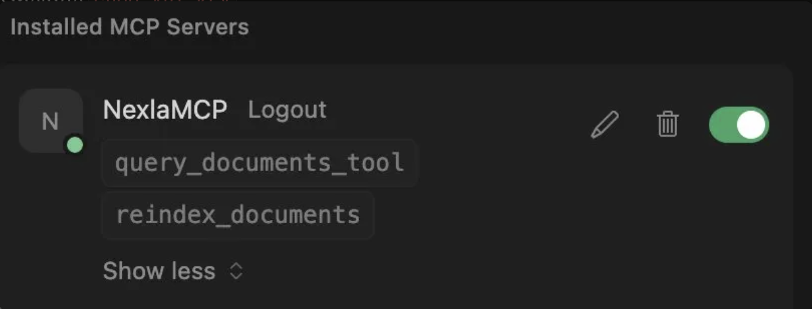

# Nexla Document Intelligence Server
### FDE AI Take-Home Assignment — Janvi Desai

A Retrieval-Augmented Generation (RAG) pipeline exposed as an MCP (Model Context Protocol) server. It ingests PDF documents, indexes them in a vector store, and exposes natural language Q&A tools that any MCP-compatible AI assistant (e.g., Cursor, Claude) can call.

---

## Architecture Overview

The system is split into two phases: **Ingestion** (indexing) and **Retrieval** (querying), both wired into a FastMCP server.

```
┌─────────────────────────────────────────────────────────────┐
│                        INGESTION                            │
│                                                             │
│  PDF files (data/)                                          │
│       │                                                     │
│       ▼                                                     │
│  PyMuPDFLoader ──► RecursiveCharacterTextSplitter           │
│  (page-level docs)   (1000 chars, 200 overlap)              │
│       │                                                     │
│       ▼                                                     │
│  HuggingFaceEmbeddings                                      │
│  (sentence-transformers/all-MiniLM-L6-v2)                   │
│       │                                                     │
│       ▼                                                     │
│  ChromaDB  →  persisted to ./chroma_db                      │
└─────────────────────────────────────────────────────────────┘

┌─────────────────────────────────────────────────────────────┐
│                        RETRIEVAL                            │
│                                                             │
│  User Question                                              │
│       │                                                     │
│       ▼                                                     │
│  Embed query (same MiniLM model)                            │
│       │                                                     │
│       ▼                                                     │
│  ChromaDB cosine similarity → top-6 chunks                  │
│       │                                                     │
│       ▼                                                     │
│  Format context with source + page metadata                 │
│       │                                                     │
│       ▼                                                     │
│  Groq API (llama-3.1-8b-instant)                            │
│       │                                                     │
│       ▼                                                     │
│  Answer + source citations                                  │
└─────────────────────────────────────────────────────────────┘
```

### Key Design Decisions

- **Switched from OpenAI to HuggingFace embeddings** — originally used `text-embedding-ada-002`, but hit a `429 RateLimitError`. Replaced with `sentence-transformers/all-MiniLM-L6-v2`, which runs fully locally with no API key required.
- **LLM iteration journey** — went through three stages before landing on the final setup:
  1. **GPT-4o-mini (OpenAI)** — initial choice; hit `RateLimitError` quickly due to limited free token quota.
  2. **google/flan-t5-base (local)** — switched to a fully offline model to avoid API limits. Hit context-size constraints immediately (`1847 > 512` tokens), as the retrieved chunks plus prompt exceeded the model's limit. Spent time tuning the prompt and truncation strategy, and explored other offline models, but ultimately concluded that downloading heavy local models (3GB+) doesn't make sense for a POC assignment.
  3. **Groq (`llama-3.1-8b-instant`)** — discovered Groq offers a generous free tier purpose-built for POC development (14,400 req/day, no credit card). Fast inference, large context window, and no local compute required. This is the current setup.
- **ChromaDB auto-persistence** — newer Chroma versions auto-persist when `persist_directory` is set; no `.persist()` call needed.
- **MCP integration with Cursor** — the MCP server was connected to Cursor IDE over HTTP for end-to-end testing during development.

---

## Project Structure

```
FDE-AI-Take-Home-Janvi-Desai/
├── src/
│   ├── config.py          # All tunable parameters and paths
│   ├── ingestion.py       # PDF load → split → embed → Chroma
│   ├── retrieval.py       # Chroma load → retrieve → LLM → answer
│   └── server.py          # FastMCP server with tool definitions
├── data/                  # Place PDF documents here
├── chroma_db/             # Auto-created vector store (git-ignored)
├── query.py               # Interactive CLI for local Q&A testing
├── run_mcp.py             # Entry point for FastMCP CLI
├── requirements.txt
└── .env                   # GROQ_API_KEY and optional DOCUMENTS_PATH
```

---

## Setup Instructions

### 1. Clone the repo

```bash
git clone https://github.com/Janvi-112/FDE-AI-Take-Home-Janvi-Desai.git
cd FDE-AI-Take-Home-Janvi-Desai
```

### 2. Create and activate a virtual environment

```bash
python -m venv .venv
source .venv/bin/activate   # Windows: .venv\Scripts\activate
```

> **Important:** Always activate `.venv` before running — the base conda environment will not have the required packages. Confirm your prompt shows `(.venv)` before running.

### 3. Install dependencies

```bash
pip install -r requirements.txt
```

### 4. Get a Groq API key (free)

Go to [https://console.groq.com/keys](https://console.groq.com/keys) and create a free API key — no credit card required.

Then add it to a `.env` file in the project root:

```
GROQ_API_KEY=your-groq-api-key-here
DOCUMENTS_PATH=/path/to/your/pdfs   # optional, defaults to data/
```

### 5. Add PDFs (Optional - 5 PDFs already uploaded in this repo)

Copy the provided PDF files into the `data/` folder.

### 6. Run ingestion (index the PDFs)

```bash
python -m src.ingestion
```

Output:
```
Ingestion complete:
{'documents': 5, 'chunks': 312, 'path': '/path/to/data'}
```

---

## Invoking the MCP Server

There are two ways to interact with this server:

---

### Option 1 — Interactive CLI (Recommended)

The easiest way to query documents locally:

```bash
python -m query
```

This launches an interactive prompt where you can type questions and get grounded answers with source citations directly in your terminal.

---

### Option 2 — FastMCP Server + Cursor / Claude

Start the MCP server locally:

```bash
fastmcp run run_mcp.py:mcp --transport http --port 5555
```

When running successfully, you'll see:



The server starts at `http://127.0.0.1:5555/mcp`.

Then connect it to **Cursor** by adding the following to your `mcp.json` in Cursor settings (`Cursor → Settings → MCP`):

```jsonc
{
  "mcpServers": {
    "NexlaMCP": {
      "url": "http://127.0.0.1:5555/mcp",
      "transport": "http"
    }
  }
}
```

Once connected, Cursor will show both tools as active:



You can then invoke `query_documents_tool` or `reindex_documents` directly from any MCP-compatible client.

---

## MCP Tool Documentation

### `query_documents_tool`

Ask a natural language question over the indexed PDFs.

| | |
|---|---|
| **Input** | `question: str` — a natural language question |
| **Output** | Grounded answer string with source document and page citations |

**Example call:**
```json
{
  "name": "query_documents_tool",
  "arguments": { "question": "What is Nexla's approach to data integration?" }
}
```

**Example response:**
```
Nexla uses a metadata-driven approach to unify data, documents, agents, and APIs into a single design pattern...

Sources: nexla_overview.pdf (page 1), nexla_whitepaper.pdf (page 4)
```

---

### `reindex_documents`

Rebuilds the vector index from PDFs on demand. Useful when documents are added or updated.

| | |
|---|---|
| **Input** | `documents_path: str` (optional) — path to PDF folder; defaults to `data/` |
| **Output** | Summary of documents and chunks indexed |

**Example call:**
```json
{
  "name": "reindex_documents",
  "arguments": {}
}
```

**Example response:**
```
Indexed 5 documents
Created 312 chunks
```

---

## Example Interaction Log

See [`EXAMPLE_INTERACTIONS.md`](EXAMPLE_INTERACTIONS.md) for real sample questions and answers returned by the system, with full source citations.

---

## Configuration Reference

| Parameter | Default | Description |
|-----------|---------|-------------|
| `CHUNK_SIZE` | `1000` | Characters per text chunk |
| `CHUNK_OVERLAP` | `200` | Overlap between adjacent chunks |
| `TOP_K` | `6` | Number of chunks retrieved per query |
| `EMBEDDING_MODEL` | `sentence-transformers/all-MiniLM-L6-v2` | Local embedding model |
| `LLM_MODEL` | `llama-3.1-8b-instant` | Groq model for answer generation |
| `COLLECTION_NAME` | `nexla_docs` | ChromaDB collection name |
| `CHROMA_PERSIST_DIR` | `./chroma_db` | Vector store persist directory |

---

## Vibe Coding Setup

### Tools Used

- **Cursor** — primary IDE for initial code generation and scaffolding
- **ChatGPT (GPT-4o) web** — switched to this after hitting Cursor's free quota limit; used for refactoring, debugging error traces, and iterating on LangChain API usage

### How I Used Them

Cursor generated the initial scaffold — the ingestion pipeline, retrieval chain, and FastMCP server structure. After exhausting Cursor's free quota, I moved to ChatGPT web for the remainder of the session. The workflow was: paste error tracebacks, describe what better implementation looks like, and direct the AI to write it that way.

One key moment: after the initial Cursor-generated code was working, I recognized the RAG pipeline could be significantly cleaner using LangChain's native `Document` structure and `PyMuPDFLoader`. Rather than accepting the generated code as-is, I prompted a full refactor to lean into LangChain's abstractions properly — the AI wrote the refactored version, but the architectural direction came from me.

### What Worked Well

- Cursor was fast for initial scaffolding and wiring known components together (loaders, splitters, vector store setup)
- ChatGPT was effective at diagnosing version-mismatch errors — e.g., `.persist()` removed in new Chroma, `get_relevant_documents` deprecated in favor of `.invoke()`
- Directing the AI with a clear architectural intent ("refactor to use LangChain Document structure") produced much better output than open-ended generation
- The generate → error → debug → fix loop was tight and productive

### Where I Overrode or Corrected the AI

- AI suggested `vectordb.persist()` — already removed in modern Chroma; had to override
- AI used `response.content` on `HuggingFacePipeline.invoke()` — that method returns a plain string, not an object with a `.content` attribute; fixed manually
- AI shadowed the `pipeline` import with a local variable of the same name inside `generate_answer`; caught and renamed
- AI consistently used deprecated LangChain patterns; verified against current docs before trusting suggestions
- AI recommended `google/flan-t5-base` without flagging its context size limitations — had to discover the `1847 > 512` truncation issue at runtime and drive the LLM migration myself

### Honest Breakdown

| | |
|---|---|
| **Code generated by AI** | ~85% |
| **Code refactored & improved manually** | ~15% |

The AI was capable of writing correct code, but it needed direction on *what* to build and *how* to structure it. The value I added was in knowing which abstractions to use, identifying when the generated approach was suboptimal, and steering the AI accordingly. The architectural decisions — LangChain-native pipeline, LLM provider choices, MCP tool design — were mine. The AI translated those decisions into code.

### Reflection on AI in Forward-Deployed Engineering

AI coding tools meaningfully accelerate the scaffolding and wiring phase of a project — assembling known components into a new shape. Where they fall short is at the boundary of rapidly-changing library APIs, where training data lags behind the current release. In a forward-deployed context, the most valuable skill isn't using AI maximally — it's knowing when to trust it, when to verify it against docs, and when to override it entirely. The debugging loop is where real engineering judgment comes in, and that loop doesn't go away with AI tooling — it just moves faster.

---

## Known Issues & Troubleshooting

| Error | Fix |
|-------|-----|
| `AttributeError: 'Chroma' object has no attribute 'persist'` | Remove `.persist()` — Chroma auto-persists with `persist_directory` set |
| `AttributeError: 'VectorStoreRetriever' has no attribute 'get_relevant_documents'` | Use `retriever.invoke(question)` instead |
| `KeyError: Unknown task text2text-generation` | Older issue with `transformers` — now resolved by switching to Groq |
| `ModuleNotFoundError: No module named 'langchain_chroma'` | Activate `.venv` before running — do not use base conda env |
| `embeddings.position_ids UNEXPECTED` warning on load | Harmless — safe to ignore for MiniLM |
| `429 RESOURCE_EXHAUSTED` from Gemini | Free tier quota exceeded — resolved by switching to Groq |

---

## Dependencies

```
# Core frameworks
fastmcp>=0.2.10
langchain>=0.2.10
langchain-huggingface>=0.0.15
langchain-chroma>=0.0.15

# Vector DB
chromadb>=0.4.0

# Document processing
pymupdf>=1.22.5
langchain-text-splitters>=0.0.9

# Embeddings & LLMs
sentence-transformers>=2.2.2
transformers>=4.36.0
groq

# Environment
python-dotenv>=1.0.0
```
